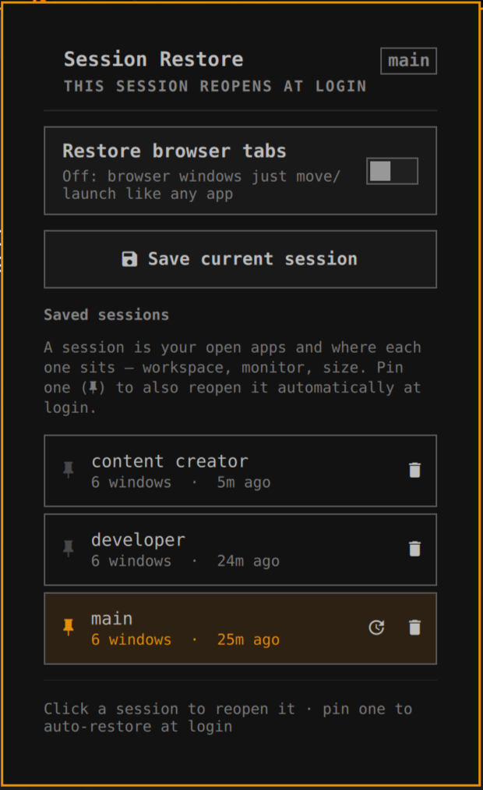

# Session Restore

<p align="center"></p>

An [Omarchy](https://omarchy.org/) shell plugin (Quickshell / Hyprland) that
saves your open apps and window layout as named **sessions** and brings them
back — on demand, or automatically after a reboot.

> Forked from [Workspace Restorer](https://github.com/Davedes83/workspace-restorer)
> by Davedes83 (MIT). What changed: see [NOTICE](NOTICE) and [CHANGELOG.md](CHANGELOG.md).

## What it does

- **Save a session** — every open window's app, workspace, monitor, position,
  size, floating/fullscreen state, working directory, and browser tabs.
- **Restore on demand** — relaunches whatever is closed onto the right
  workspace; moves already-open windows back into place instead of duplicating.
- **Restore at login** — pin one session and it reopens a few seconds after you
  log in. Once per login only — a mid-session `omarchy restart shell` won't
  re-trigger it.

**Not restored:** the tiled arrangement *within* a workspace (which window is
beside which, split ratios). See [Limitations](#limitations).

## Install

```bash
omarchy plugin add https://github.com/dreed47/omarchy-session-restore
```

Or clone into the plugin directory and enable it:

```bash
git clone https://github.com/dreed47/omarchy-session-restore \
  ~/.config/omarchy/plugins/io.github.dreed47.session-restore
```

```json
// ~/.config/omarchy/shell.json
{ "bar": { "layout": { "right": [ { "id": "io.github.dreed47.session-restore" } ] } } }
```

```bash
omarchy restart shell
```

## Requirements

- Omarchy with the Quickshell bar, Hyprland
- `node` >= 18 — `omarchy pkg add nodejs`
- `python3` (browser tab capture; the rest works without it)

## Using it

Click the bar icon to open the panel.

- **Save current session** → name it.
- **Click a session** to reopen it now.
- **Pin** (the pushpin on the left of a row) marks the session that reopens at
  login. The pinned row is tinted and the header shows its name; click the pin
  again to turn it off. One pinned at a time.
- The pinned row gets an **update** action (↻) that re-saves it from the windows
  open right now.
- **Delete** is a two-click confirm on the trash icon.

Hovering any control shows what it does in the line at the foot of the panel.

## Command line

The engine is a standalone CLI (this is also what the login service runs):

```bash
bin/session-restore save <name>        # capture the current layout
bin/session-restore restore <name>     # reopen it
bin/session-restore list               # saved sessions (* = pinned for login)
bin/session-restore status             # + which session is pinned
bin/session-restore delete <name>
bin/session-restore boot-profile <name>   # pin for login   (--clear to unpin)
bin/session-restore restore --boot        # what the login service runs
```

Profiles are JSON in `~/.config/omarchy/session-restore/` (override with
`SESSION_RESTORE_DIR`).

To test the login path without logging out:

```bash
rm -f "$XDG_RUNTIME_DIR/session-restore/applied"
omarchy-shell session-restore.service applyLogin
# or, bypassing the compositor-age guard:
SESSION_RESTORE_BOOT_WINDOW=99999 bin/session-restore restore --boot
```

## How it works

- Capture: `hyprctl -j clients` + `hyprctl -j monitors`, plus each window's
  command line and working directory from `/proc/<pid>` (keyed by PID so
  nothing misaligns), plus browser tabs via `scripts/capture_tabs.py`.
- Restore: reads the profile, matches it against currently-open windows in
  three passes (exact class+title, then class + current workspace, then class
  only), moves the matched ones, and spawns the rest — focusing each target
  workspace first so windows open where they belong. A detached pass re-checks
  slow apps (Electron) for ~15s.
- All of that lives in `bin/session-restore`; the bar widget and the login
  `service` entry point both shell out to it, so there is one code path.
- Login trigger: the `service` half runs `restore --boot` a few seconds after
  each shell start. The CLI acts only if the Hyprland instance came up within
  `SESSION_RESTORE_BOOT_WINDOW` seconds (default 120) and it hasn't already run
  for this Hyprland instance (a stamp in `$XDG_RUNTIME_DIR`, keyed to
  `$HYPRLAND_INSTANCE_SIGNATURE`).

## Limitations

The **tiled arrangement inside a workspace is not restored**. Tiled windows
come back onto their workspace and land wherever dwindle puts them.

This is deferred, not merely unbuilt: it needs Hyprland to expose the dwindle
split tree and ratios, which it does not yet
([hyprwm/Hyprland#13035](https://github.com/hyprwm/Hyprland/discussions/13035);
the `splitratio` dispatcher was also removed). Building it as a geometry
heuristic is `io.github.imryiuk.workspace-profiles`' territory, not this
plugin's. Full rationale and the trigger condition:
[docs/tiled-layout-restore.md](docs/tiled-layout-restore.md).

## Development

```bash
npm test              # unit tests for the pure engine logic
npm run validate      # check manifest.json against the plugin schema
```

The bar widget has no automated check — after editing `BarWidget.qml`,
`rm -rf ~/.cache/quickshell && omarchy restart shell` (a plain
`rescanPlugins` does not reload QML).

## License

MIT — see [LICENSE](LICENSE) and [NOTICE](NOTICE).
